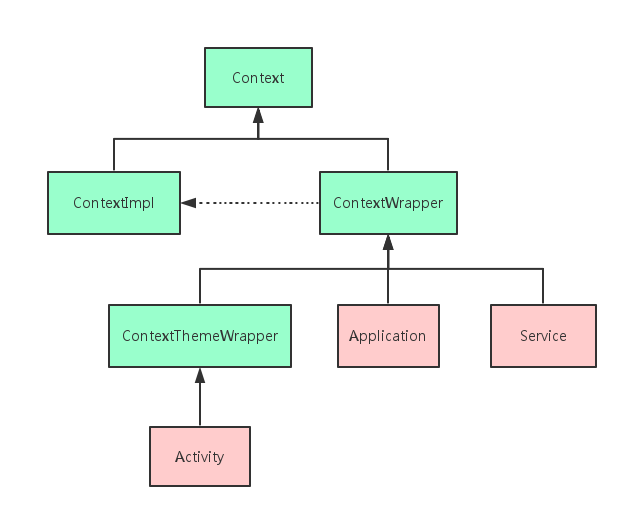
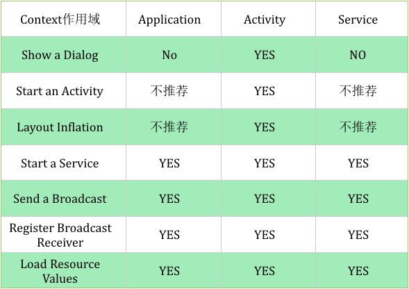

##关于Context	
- Context是维持Android程序中各组件能够正常工作的一个核心功能类。
- Context提供了关于应用环境全局信息的接口.它是一个抽象类，它的执行被Android系统所提供
- 它允许获取以应用为特征的资源和类（包括应用级别操作，如启动Activity，发广播，接受Intent等），是一个统领一些资源（应用程序环境变量等）的上下文

####Context源码

		public abstract class Context {
			public static final int MODE_PRIVATE = 0x0000;
			public static final int MODE_WORLD_WRITEABLE = 0x0002;
			public static final int MODE_APPEND = 0x8000;
			public static final int MODE_MULTI_PROCESS = 0x0004;
			...
		}
	

####Context的两个子类分工明确

	ContextImpl是Context的具体实现类.
	ContextWrapper是Context的包装类。
	
	Activity，Application，Service虽都继承自ContextWrapper（Activity继承自ContextWrapper的子类ContextThemeWrapper）,
	但它们初始化的过程中都会创建ContextImpl对象，由ContextImpl实现Context中的方法。

	在应用程序中Context的具体实现子类就是：Activity，Service，Application。
	那么Context数量 = Activity数量+Service数量+ 应用进程数量。	

#### Context能干什么

>	太多了，弹出Toast、启动Activity、启动Service、发送广播、操作数据库等等都需要用到Context。
	
####Context的作用域

>
	由于Context的具体实例是由ContextImpl类去实现的，因此在绝大多数场景下，Activity、Service和Application这三种类型的Context都是可以通用的。
	不过有几种场景比较特殊，比如启动Activity，还有弹出Dialog。出于[安全原因]的考虑，Android是不允许Activity或Dialog凭空出现的
		一个Activity的启动必须要建立在另一个Activity的基础之上，也就是设置标记栈。
		而Dialog则必须在一个Activity上面弹出（除非是System Alert类型的Dialog），因此这种Dialog只能使用Activity类型的Context，否则将会出错。
	
####Context注意事项
	[1]非Activity类型的Context并没有所谓的任务栈，想要在非Activity中开启Activity,就要为待启动的Activity指定FLAG_ACTIVITY_NEW_TASK标记位.
	[2]在Application和Service中去layout inflate也是合法的，但是会使用系统默认的主题样式，如果你自定义了某些样式可能不会被使用.
	[3]凡是跟UI相关的，都应该使用Activity做为Context来处理；其他的一些操作Service,Activity,Application等实例都可以.注意Context引用的持有，防止内存泄漏。
	
####获取Context
	View.getContext()//通常是当前正在展示的Activity对象。
	Activity.getApplicationContext()//当前Activity所在的(应用)进程的Context对象//全局的进程Context
	ContextWrapper.getBaseContext()//不建议使用
	Activity.this//一般是UI控件需要使用Activity作为Context对象使用
	
####getApplication()和getApplicationContext()的区别
	是同一个对象.//Application本身就是一个Context，所以这里获取getApplicationContext()得到的结果就是Application本身的实例。
	在作用域上有比较大的区别.
		getApplication()在Activity和Service中才能调用的到.
		getApplicationContext(): 大多数,比如BroadcastReceiver中也想获得Application 就用此方法获取.
	

####Context引起的内存泄露
	被static是常驻内存的,所以造成内存泄漏
	
####Context的正确姿势：
	1：当Application的Context能搞定的情况下，并且生命周期长的对象，优先使用Application的Context。
	2：不要让生命周期长于Activity的对象持有到Activity的引用。
	3：尽量不要在Activity中使用非静态内部类，因为非静态内部类会隐式持有外部类实例的引用，如果使用静态内部类，将外部实例引用作为弱引用持有。		
		也尽量少用在静态对象中(避免常驻内存).
