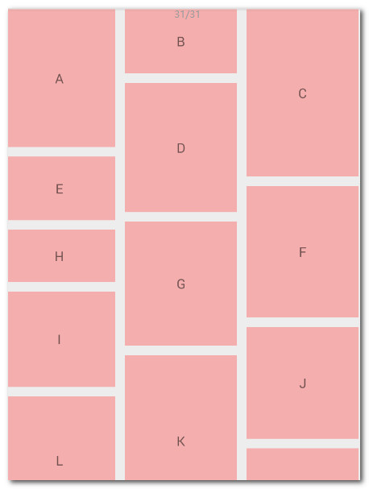

##RecyclerView的使用
- 在support-v7 widget包下
- 通过布局管理器LayoutManager	控制其显示的方式	
- 通过ItemDecoration	控制Item间的间隔（可绘制）
- 通过ItemAnimator		控制Item增删的动画

>
>RecyclerView的代码
>
	//布局管理器LayoutManager//有3种
	LayoutManager layout = new LinearLayoutManager(上下文);
	//设置布局管理器
	mRecyclerView.setLayoutManager(layout);
	//设置adapter//extends RecyclerView.Adapter
	mRecyclerView.setAdapter(adapter)

- 其他
>
	//设置Item增加、移除动画
	mRecyclerView.setItemAnimator(new DefaultItemAnimator());
	//添加分割线
	mRecyclerView.addItemDecoration(new DividerItemDecoration(
    getActivity(), DividerItemDecoration.HORIZONTAL_LIST));

>
>RecyclerView的适配器和方法//extends RecyclerView.Adapter
>
	onCreateViewHolder()创建Holder
	onBindViewHolder()绑定数据//一般调用参数的holder让holder绑定数据,本方法传递数据
	getItemCount()//数据数量
	//适配器的getItemViewType(),废弃了getItemCount()

####LayoutManager布局管理器,实现不同的布局方式
- RecyclerView.LayoutManager吧，这是一个抽象类，好在系统提供了3个实现类：

	LinearLayoutManager 线性管理器，支持横向、纵向。
		 mRecyclerView.setLayoutManager(new LinearLayoutManager(this));

	GridLayoutManager 网格布局管理器
		 mRecyclerView.setLayoutManager(new GridLayoutManager(this,4));

	StaggeredGridLayoutManager 瀑布就式布局管理器
		mRecyclerView.setLayoutManager(new StaggeredGridLayoutManager(4, StaggeredGridLayoutManager.VERTICAL));
			StaggeredGridLayoutManager.VERTICAL代表有多少列；
			StaggeredGridLayoutManager.HORIZONTAL代表有多少行

原理:onBindViewHolder方法中为我们的item设置个随机的高度

###RecyclerView和ListView的异同
	[1]方向
		ListView只能在垂直方向上滚动，Android API没有提供ListView在水平方向上面滚动的支持. 当然我们可以封装ListView成横向样式
			
		而RecycleView:
			LinearLayoutManager	可以支持水平和竖直方向上滚动的列表。
			StaggeredGridLayoutManager，可以支持交叉网格风格的列表，类似于瀑布流或者Pinterest。
			GridLayoutManager，支持网格展示，可以水平或者竖直滚动，如展示图片的画廊。

	[2]动画
		相比较于ListView，RecyclerView.ItemAnimator则被提供用于在RecyclerView添加、删除或移动item时处理动画效果。如果你比较懒，不想自定义ItemAnimator，你还可以使用DefaultItemAnimator。
	
	[3]观察者
		ListView能够通过registerDataObserver在Adapter中注册一个观察者。
		RecyclerView的RecyclerView.AdapterDataObserver就是这个观察者。
	
	[4]适配器和功能
		ListView有三个Adapter的默认实现，分别是ArrayAdapter、CursorAdapter和SimpleCursorAdapter。
		RecyclerView的Adapter则拥有除了内置的数据库DB游标和ArrayList的支持之外的所有功能。

	[5]拦截触摸事件的控制权限
		ListView通过AdapterView.OnItemClickListener接口来探测点击事件。
		而RecyclerView则通过RecyclerView.OnItemTouchListener接口来探测触摸事件。它虽然增加了实现的难度，但是却给予开发人员拦截触摸事件更多的控制权限。
		
		RecyclerView没有提供ClickListener和LongClickListener

	[6]选择模式
		ListView可以设置选择模式，并添加选择监听MultiChoiceModeListener
		而RecyclerView则没有此功能

##RecycleView的源码分析
####ItemDecoration分割线抽象类源码

	public static abstract class ItemDecoration {
		
		public void onDraw(Canvas c, RecyclerView parent, State state) {
		            onDraw(c, parent);
		 }
		
		public void onDrawOver(Canvas c, RecyclerView parent, State state) {
		            onDrawOver(c, parent);
		 }
		
		public void getItemOffsets(Rect outRect, View view, RecyclerView parent, State state) {
		            getItemOffsets(outRect, ((LayoutParams) view.getLayoutParams()).getViewLayoutPosition(),
		                    parent);
		}
		
		@Deprecated
		public void getItemOffsets(Rect outRect, int itemPosition, RecyclerView parent) {
		            outRect.set(0, 0, 0, 0);
		 }
	}
		通过该方法添加分割线： mRecyclerView.addItemDecoration() 
			[1]RecyclerView在绘制的时候，去会绘制decorator，即调用该类的onDraw和
			- onDraw方法先于drawChildren
			- onDrawOver在drawChildren之后，一般我们选择复写其中一个即可。
			- getItemOffsets 可以通过outRect.set()为每个Item设置一定的偏移量，主要用于绘制Decorator。

>	DividerItemDecoration ,RecyclerView.ItemDecoration的实现类,该类很好的实现了RecyclerView添加分割线
	
	- 该实现类可以看到通过读取系统主题中的 Android.R.attr.listDivider作为Item间的分割线，并且支持横向和纵向。(所以我们可以在theme.xml中修改样式节点listDivider的drawable值来自定义分割线的样式)
	- 获取到listDivider以后，该属性的值是个Drawable.
	- 在getItemOffsets中，outRect去设置了绘制的范围。
	- onDraw中实现了真正的绘制。
	- 操作:mRecyclerView.addItemDecoration(new DividerItemDecoration(this,
DividerItemDecoration.VERTICAL_LIST));

>	DividerGridItemDecoration, RecyclerView.ItemDecoration的实现类  ,主要运用在GridLayoutManager时
	
	- getItemOffsets方法中，去判断如果是最后一行，则不需要绘制底部；
	- 如果是最后一列，则不需要绘制右边，整个判断也考虑到了StaggeredGridLayoutManager的横向和纵向，所以稍稍有些复杂。
	- 一般如果仅仅是希望有空隙，还是去设置item的margin方便。

####ItemAnimator动画抽象类
	github有好多ItemAnimator动画的效果
> 操作:一般由于删除或者增加而添加的动画
>
	// 设置item动画
	mRecyclerView.setItemAnimator(new DefaultItemAnimator());
>注意事项
>
	这里更新数据集不是用adapter.notifyDataSetChanged()
	而是 notifyItemInserted(position)与notifyItemRemoved(position)
	否则没有动画效果

>具体实现:需求:点击菜单按钮进行删除和添加item
>
	[1]在adapter添加如下方法来添加或者删除动画
		public void addData(int position) {
	        mDatas.add(position, "Insert One");
	        notifyItemInserted(position);
	    }
	    public void removeData(int position) {
	            mDatas.remove(position);
	        notifyItemRemoved(position);
	    }
	[2]添加菜单按钮进行操作添加和删除动画的实现
	    @Override
	    public boolean onCreateOptionsMenu(Menu menu){
	        getMenuInflater().inflate(R.menu.main, menu);
	        return super.onCreateOptionsMenu(menu);
	    }
>
	    @Override
	    public boolean onOptionsItemSelected(MenuItem item){
	        switch (item.getItemId())
	        {
	        case R.id.id_action_add:
	            mAdapter.addData(1);
	            break;
	        case R.id.id_action_delete:
	            mAdapter.removeData(1);
	            break;
	        }
	        return true;
	    }
	
###设置RecycleView的Item的Click和LongClick
	系统没有提供ClickListener和LongClickListener,我需要我们自己去实现
	[方式1]通过mRecyclerView.addOnItemTouchListener去监听然后去判断手势
	[方式2]通过adapter中自己去提供回调

	方式2:
	思路:
	[1]
		onBindViewHolder(){
	 		if (mOnItemClickLitener != null){
				holder.itemView.setOnClickListener(...){
					监听接口.clickListener();
					....	
				}			
	
				holder.itemView.setOnLongClickListener(...){
					监听接口.clickLongListener();
					....	
				}
			}
		}
	[2]adapter中自己定义了个接口，然后在onBindViewHolder中去为holder.itemView去设置相应的监听最后回调我们设置的监听。

###Adapter的封装
	抽取基类  详情看离线文档

###横向的ListView的封装

	1、在布局里用HorizontalScrollView包含一个ListView，参考这里;
	
	2、利用GridView，把它的行数设为1行；
	
	3、继承ListView构造了一个HorizontalScrollListView.
	
	4、继承AdapterView<ListAdapter>构造的HorizontalListView