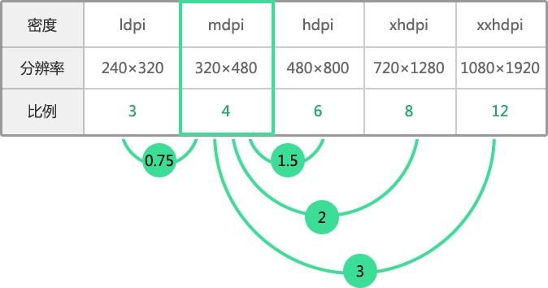
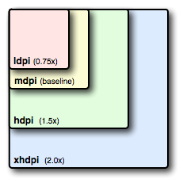
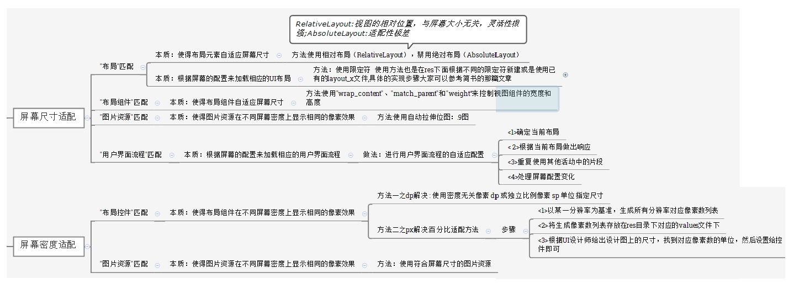
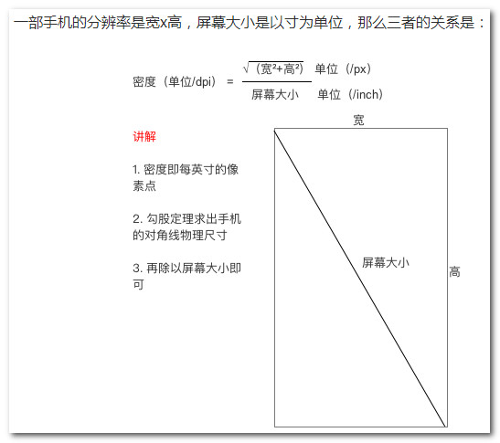
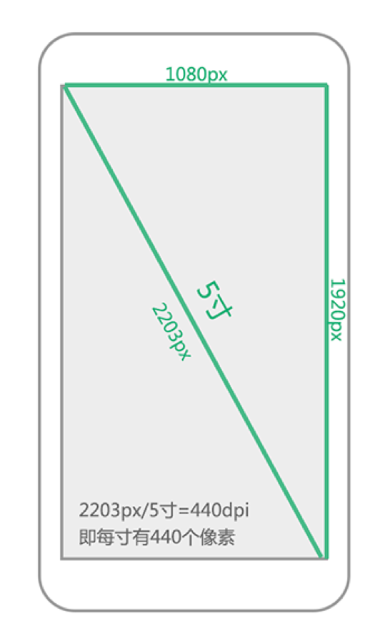
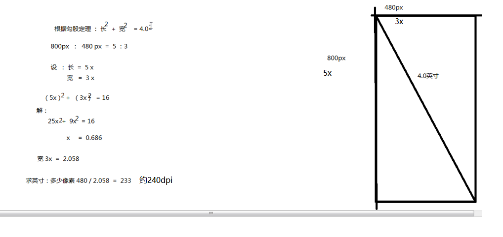
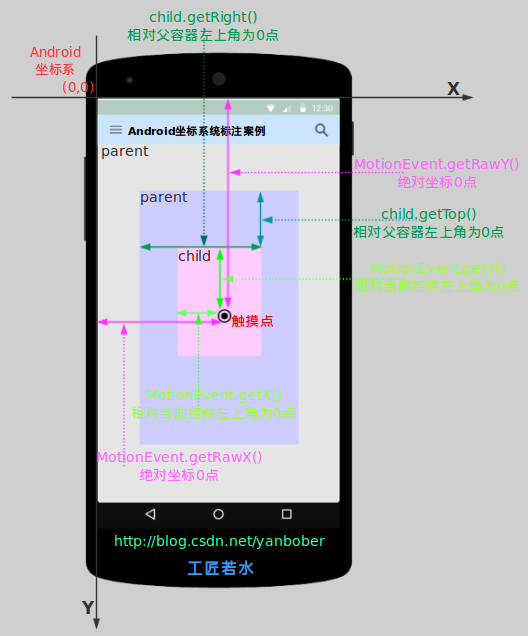
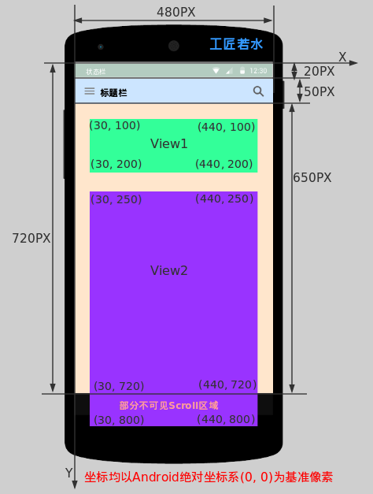
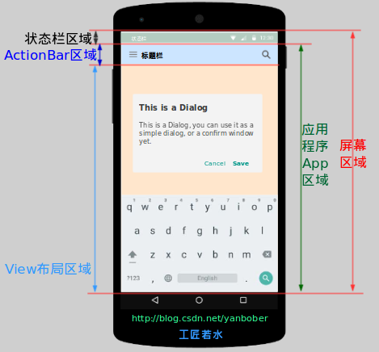

## 屏幕适配 ##
	养成良好的开发习惯://面试
		多用dp,sp,不用px; //sp是奇数和小数容易造成精度丢失
		多用线性布局和相对布局, 不用绝对布局; 
		代码中如果必须设置像素的话, 将dp转为px进行设置
	
	概念:
		屏幕尺寸:屏幕对角线的长度，单位是英寸，1 inch=2.54 cm
		屏幕大小:物理屏幕的大小,看屏幕的对角线
		分辨率	:实际上是像素的总和, 比如1280*720.1px=1个像素点
		dpi		:屏幕像素密度(每英寸所展示的像素,屏幕像素密度与屏幕尺寸和屏幕分辨率有关.	屏幕尺寸越小、分辨率越高，像素密度越大，反之越小。)
		dp(dip) :屏幕密度无关像素	
		sp		:独立比例像素
		px		:像素的单位.	比如UI设计、Android原生API都会以px作为统一的计量单位，像是获取屏幕宽高等

- 比率(根据dpi计算)

			分辨率			
		ldpi:	240*320  	QVGA	0.75	~120dpi
		mdpi: 	320*240	 	HVGA 	1		~160dpi	Android中标准的分辨率//baseline//1dp=1px
		hdpi: 	480*800 	WVGA 	1.5		~240dpi
		xhdpi: 	1280*720	720P 	2		~320dpi
		xxhdpi: 1920*1080 	1080p 	3		~480dpi
		xxxhdpi:3840×2160	4K		4		~640dpi

(最后面附上dpi的计算)

###屏幕适配问题的本质
	使得“布局”、“布局组件”、“图片资源”、“用户界面流程”匹配不同的屏幕尺寸 
		根据屏幕的配置来加载相应的UI布局、用户界面流程	
	使得“图片资源”匹配不同的屏幕密度

###解决方案

全集:

主要:

	图片适配
		常规做法: 做一套图 1280*720 切图, 放在hdpi或xhdpi下, ImageView宽高指定为确定的值, 不包裹屏幕. 
					如果某个屏幕出了问题, 再针对该屏幕, 对相关出问题的图片进行替换.
	

	layout布局文件适配(不太常用)
		layout-800x480:专门针对480*800屏幕适配的布局文件, 一般只调整位置和大小, 不建议对控件类型和个数进行调整

	尺寸适配(dimens,很常用)
		//dp 和 px
		dp = px/设备密度
			设备密度:float density = getResources().getDisplayMetrics().density;
		创建文件夹values-1280x720, 在dimens.xml中制定尺寸, 适配屏幕
			//values-1280x720/dimens.xml
		常规做法: 此方法比布局适配更常用. 美工提供像素px值, 我们使用前需要用px除以设备密度,转换成dp后,写在布局文件中

	权重适配
		android:weightSum="3"//父控件给予总和
		常规做法: 当布局有严格比例分配时, 可以使用权重来处理
		权重weight的计算
			宽度 = 原来宽度 + 权重比值 * 剩余宽度
			[1]当layout_width为0dp，layout_weight分别是1和2
				第一个按钮：宽度 = 0 + 1/3 * 屏宽 = 1/3屏宽
				第二个按钮：宽度 = 0 + 2/3 * 屏宽 = 2/3屏宽
	
			[2]当layout_width为match_parent, layout_weight分别是1和2
				第一个按钮：宽度 = 屏宽 + 1/3 (屏宽 - 2 屏宽) = 2/3屏宽
				第二个按钮：宽度 = 屏宽 + 2/3 (屏宽 - 2 屏宽) = 1/3屏宽
	 
	代码适配
		通过LayoutParams//由这个空间的父控件来决定这个LayoutParams是谁的
		常规做法: 如果是自定义的控件, 没有使用xml布局文件时, 可以在代码中动态设置宽高

###其他适配补充

	布局控件匹配
		使用相对布局（RelativeLayout），禁用绝对布局（AbsoluteLayout）

	尺寸（size）限定符(large)
		只适合Android 3.2版本之前
			在平板电脑和电视的屏幕（>7英寸）上：实施“双面板”模式以同时显示更多内容
				双面板布局:res/layout-large/main.xml
			在手机较小的屏幕上：使用单面板分别显示内容
				单面板（默认）布局：res/layout/main.xml
			注意:两个布局XML名称均为main.xml
	
	最小宽度（Smallest-width）限定符
		适合在Android 3.2及之后版本
			是以dp为标准的.
			适配尺寸>7寸平板的双面板布局：res/layout-sw600dp/main.xml
				对于最小宽度≥ 600 dp 的设备
			适配手机的单面板（默认）布局：res/layout/main.xml
			注意:两个布局XML名称均为main.xml

- Android AutoLayout:
  [Android AutoLayout全新的适配方式](http://blog.csdn.net/lmj623565791/article/details/49990941/)

###dpi的计算

### 屏幕坐标

