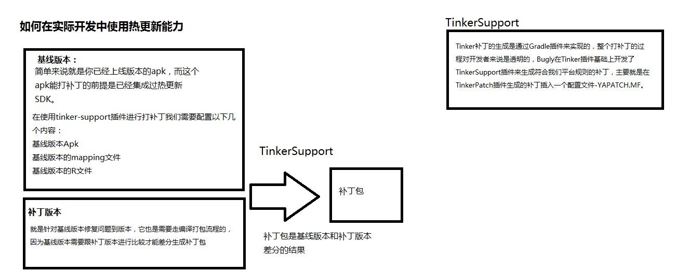
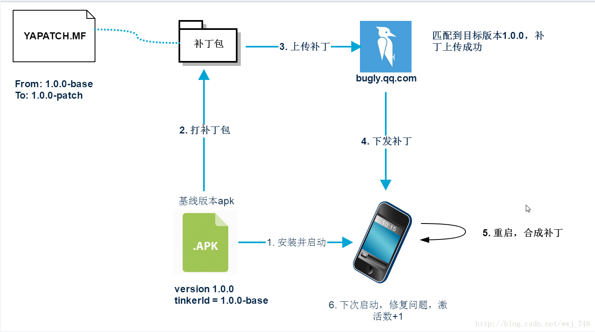

#热更新和热修复(本文主要讲腾讯Bugly(开发平台) )

###热更新是什么
> 最简单的解释就是不关软件直接更新，更新期间软件直接用
>
> 现在大部分软件是冷更新，要退出才能更新
> >当然, 服务器也有热更新和冷更新的说法---(热部署和冷部署)----->热更新的时候不需要关闭服务器,直接重新部署项目就行。冷的自然就是关闭服务器后再操作

 了解热更新(举例ISO的JSPatch)
-
JSPatch 是 iOS 平台上的一个开源库，只需接入极小的三个引擎文件，即可以用 JS 调用和替换任意 OC 方法，也就是说可以在 APP 上线后通过下发 JS 脚本，实时修改任意 OC 方法的实现，达到修复 bug 或动态运营的目的。目前 JSPatch 被大规模应用于热修复(hotfix)，已有超过2500个 APP 接入

虽然JSPatch 目前大部分只用于热修复，但因为 JSPatch 可以调用任意 OC 方法，实际上它也可以做热更新的工作，也就是动态为 APP 添加功能模块，并对这些功能模块进行实时更新，可以起到跟React Native一样的作用。

OC 是一门动态运行时的语言,方法的运行和对象的创建是在运行时中创建的.JSPatch 正的用运行时,通过JavaScriptCore.framework作为 JS引擎,从 JS 动态调用方法和对象到OC 中,再作用NSInvocation动态调用对应的方法

###为什么需要热更新
	热更新能力是为解决开发者紧急修复线上Bug，而无需重新发版让用户无感知就能把问题修复的一项能力。
	通过发版来解决问题的话周期又太长.避免频繁发版来保证产品的稳定性.

注意事项:

	开发者最好不要依赖热更新来保证产品质量，建议在产品需要紧急修复问题的情况下才应该考虑热更新。

###Bugly哪些东西可能是我们需要修改的
	类文件
	So库
	资源

###Bugly但是不支持你修改什么
	AndroidManifest文件
	新增四大组件

###Android中(J2EE专用): JRebel实现Idea热更新(热部署)

###热更新方案:(平台)
	微信开源：Tinker
	大众点评：Nuwa
	阿里巴巴：Dexposed
	阿里巴巴：AndFix
	美团：Robust

###目前Bugly使用的是Tinker方案
	Tinker是一个开源框架，而Bugly热更新SDK是基于这套框架进行的能力封装，提供接口方便开发者能够快速实现热更新能力。

	而Tinker只是开源了客户端代码，并没有开源补丁管理后台，我们Bugly也提供了补丁管理后台，所以开发者只需要接入我们SDK就无需自己搭建补丁管理后台。

	所以说Bugly提供的是一整套热更新能力解决方案，而不仅仅是客户端的能力。

###加固包怎么使用热更新？
	在1.7.8版本以上才支持,否则会引入一些更加严重的问题.

###热修复技术Xposed